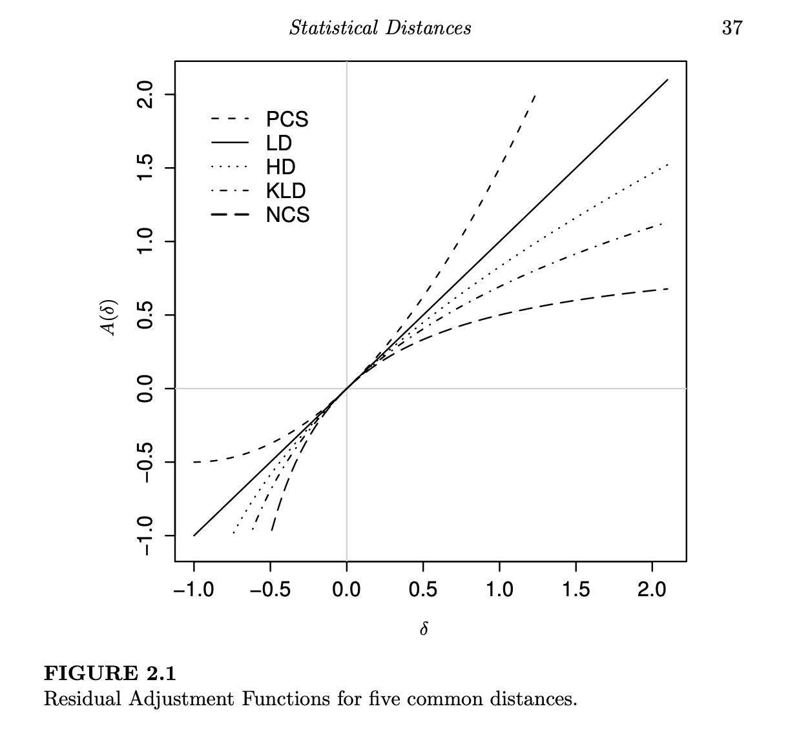

\newtheorem{definition}{Definition}
\newtheorem{theorem}{Theorem}
\newtheorem{lemma}{Lemma}

\section{Statistical Inference: The Minimum Distance Approach}

Statistical modeling relies on the quantification of how much the data disagrees with the model. This is assessed through divergence. For example, one might want to measure the distance between a nonparametric density estimates. A good example of this is the chi-square distance of Pearson. (@Ayanendranath2011)

Most density-based divergences are not mathematical distances because they are not metrics: most are not symmetric. Sometimes the asymmetry is a desireable property. These divergences are non-negative and should equal 0 if the data match the model precisely.

\subsubsection{Distances Based on Distribution Functions}

Suppose $G_n(x)$ is an empirical distributino function and let ${F_\theta : \theta \in \Theta \subset \mathbb{R}^p}$ be a parametric family of distributions used to describe the true distribution. A general way to measure distacne between $G_n$ and $F_\theta$ is $\rho(G_n,F_\theta)$. The weighted *Kolmorgorov-Smirnov* distance is usually given by the below formula with $\psi(u)=1$:
$$\rho_{KS}(G_n,F_\theta)=\sup_{-\infty<z<\infty}|G_n(z)-F_\theta(z)|\sqrt{\psi(F_\theta(z))}$$
The ordinary Kolmorgorov-Smirnov distance can be used to test the null that the known distribution $G_n$ represents the true data generating distribution. The Kolmogorov-Smirnov distance has been used in pattern recognition, image comparison and segementation, signature verification, credit scoring, and library design. The ordinary distance related to continous distributions, so modifications are needed to apply to discrete and discontinuous distributions.

The *Cramér-von Mises distance* bewteen the empirical dist and distribution function is given by:
$$\rho_{CM}(G_n, F_\theta)=\int_{-\infty}^{\infty}(G_n(z)-F_\theta(z))^2 \psi(F_\theta(z))dF_\theta(z)$$
Where $\psi(u)=1$ gives the usual distance.

\subsection{Density-Based Distances}

Focus of this book is on chi-square type distances, $\phi$-divegrences, $f$-divergences, $g$-divergences, or disparities.

\subsubsection{The Distances in Discrete Models}

Let's say your goal is to estimate the parameter $\theta$ efficiently and robustly, by determining the element of the model family which provides the closest match to the data in terms of the distance. This is akin to quantifying the separation between two probability vectors that sum to 1. One way to quantify this separation is through the class of disparities; see also Csiszar and Ali and Silvey (pg 27).

\begin{definition}
Let C be a thrice differentiable, strictly convex function on [-1, $\infty$] satisfying $C(0)=0$. Let the Pearson residual at the value X be defined by $$\delta(x)=\frac{d_n(x)}{f_\theta(x)}-1$$.
Then the **disparity** between vector $\vec{d}$ and $\vec{f_\theta}$ is: $$\rho_C(d_n, f_\theta)=\sum_{x=0}^{\infty}C(\delta(x))f_\theta(x)$$
\end{definition}

Thrice differentiability and convexity are the disparity conditions. $\rho_C(d_n, f_\theta)$ is a general way of writing a distance satisyfing the disparity conditions. $C$ is the disparity generating function.

Jensen's inequality shows that the disparity is nonzero and that it only equals 0 when the two vectors are equal. Therefore this disparity meets the minimum requirements for a statistical distance.

Specific forms of the function $C$ generate many well known disparities. For example:

1. $C(\delta)=(\delta+1)log(\delta+1)-\delta$ genereates the **likelihood disparity (LD)**
2. The symmetric opoosite of the likelihood disparity (swapping the vectors) is the **Kullback-Leibler divergence (KLD)**
3. The distance that corresponds to $C(\delta)=\delta-log(\delta+1)$ is the **Hellinger distance (HD)**
4. $C(\delta)=\delta-log(\delta+1)$ yields the **Pearson's chi-square (PCS)**
5. $C(\delta)=\frac{\delta^2}{2}$ yields the **Neyman's chi-square (NCS)**.

\subsubsection{Power divergences}

There are several important subfamilies of disparities. The *Cressie-Read* family of power divergences is indexed by a real tuning parameter $\lambda$ and formulated as follows:

$$PD_\lambda(d_n, f_\theta)=\frac{1}{\lambda(\lambda+1)}\sum d_n \bigg [ \bigg(\frac{d_n}{f_\theta}\bigg)^\lambda -1\bigg]$$
Different choices of lambda yield common statistical distances/divergences.

We can reparametrize this formula s.t. $\alpha=-(1+2\lambda)$:

$$PD_\alpha^*(d_n, f_\theta)=\frac{4}{1-\alpha^2}\sum_x d_n \bigg [-1 \bigg(\frac{f_\theta}{d_n}\bigg)^{(1+\alpha)/2}\bigg]$$.

This formulation is symmetric about $\alpha=0$ (which corresponds to the hellinger distance). Distances corresponding to $\alpha$ and $-\alpha$ are adjoints of one another.

It can also be reformulated to be nonnegative and convex, leading to some important asymptotic properties. This means that $C$ is standardized (centered and scaled) s.t. $C'=0$ and $C''=0$. This has no effect on the parameter that minimizes the divergence.

\subsubsection{Other families}
Other subfamilies include the blended weight Hellinger distance, blended weight chi-square divergence, negative exponential disparities, generalized KL divergence.

\begin{lemma}
Suppose that C(-1) and C'($\infty$) are finite. Then the disparity $\rho_C(g,f)$ is bounded above by $C(-1)+C'(\infty)$
\end{lemma}

\subsubsection{The Hellinger Distance}

Note that the actual Hellinger distance is one half square root of the hellinger disparity measure:
$$\left\{ \sum(d_n^{1/2}-f_\theta^{1/2})^2 \right\} ^{1/2}=\left\{ \frac{1}{2}HD(d_n, f_\theta) \right\} ^{1/2}$$
This distance satifies the triangle inequality and the disparity measure $HD(d_n, f_\theta)$ is very popular in robust minimum distance literature. Notice that the term inside the left hand side is related to:
$$B(d_n, f_\theta)=-log \left( \sum_x d_n^{1/2} f_\theta^{1/2} \right)$$

This is the Bhattacharyya coefficient, which can be thought of as the approximate overlap between two probability densities.

\subsubsection{Renyi divergence}

Bhattacharyya's distance may be looked at as a special case of the **Rényi divergence**: $$RD_r(d_n, f_\theta)=\frac{1}{r(r-1)}log \left( \sum_x d_n^r(x)f^{1-r}_\theta(x) \right), r \neq 0,1$$

When $r=0$ we get the LD (Likelihood disparity). When $r=1$ we get the KLD.

Stopped at page 14. Will resume tomorrow.

\subsection{Minimum distance estimator}

Maximizing the likelihood is equivalent to minimizing the likelihood disparity $\sum d_n log(d_n/f_\theta)$. Thus the class of minimum distance estimators includes the maximum likelihood estimator under discrete models. To idenify the mimimum distance estimator, we take a derivative of sorts wrt $\theta$.

$$-\nabla \rho_C(d_n, f_\theta)=\sum (C'(\delta)(\delta+1)-C(\delta))\nabla f_\theta =0$$
or 

\begin{equation}
  \label{eq:1}
  -\nabla \rho_C(d_n, f_\theta)=\sum A(\delta) \nabla f_\theta =0
\end{equation} 

Where $A$ is called the residual adjustment factor (RAF) (has value and derivative at 0 standardized to certain values).

Estimating equations differ only based on the formula for the RAF.

Suppose we want to robustly estimate our parameter $\theta$. Our aim is to downweight observations having large positive values of $\delta$ (the Pearson residual, because thse correspond to large outliers in relation to our parametric model). This is achieved by such disparities for whch the RAF exhibits a severely dampening response to increasing $\delta$ (pg 36).

HD, KLD, NCS all downweight large $\delta$ relative to the LD. PCS magnifies the effect of outliers.

When we expand out \ref{eq:1} using a Taylor series, we see that $A''(0)$ plays a major role in determining the estimators properties.

Proper controlling of inliers (negative value of $\delta$) need to be shrunk as well, for good small sample efficiency.

\subsection{The Robustified Likelihood Disparity}

Minimum distance technique is based on two things $C$, the disparity generating function, and $A$, the residual adjustment function (RAF). We usually start with $C$, take the derivative wrt the parameter and suitably standardize it to get the RAF.

We can do this in reverse: define RAF with right properties and then construct the distance. The \textbf{disparity generating function} is defined as follows:

\begin{equation}
  \label{eq:2}
  C(\delta)=\int_0^\delta \int_0^t A'(s) (1+s)^{-1} dsdt
\end{equation} 

Most mimimum distance estimators qualities are governed by smothness and derivative magnitudes at $\delta=0$ for the RAF. 

The \textbf{robustified likelihood disparity} acts like the likelihood equations around $\delta=0$ but powerfully downweights outliers in the way that the RAF is defined.

\begin{equation}
A_{\alpha, \alpha^*}(\delta)=
  \begin{cases}
  \alpha & \text{for } -1 \leq \delta \leq \alpha \\
  \delta & \text{for } \alpha < \delta < \alpha^* \\
  \alpha^* & \text{for } \delta \geq \alpha^* \\
  \end{cases}
\end{equation}

The corresponding disparity generating function (or the \textbf{robustified likelihood disparity} with tuning paramaters $\alpha$ and $\alpha^*$) is:

\begin{equation}
C_{\alpha, \alpha^*}(\delta)=
  \begin{cases}
  (\delta+1)\log(\alpha+1)-\alpha & \text{for } -1 \leq \delta \leq \alpha \\
  (\delta+1)\log(\delta+1)-\delta & \text{for } \alpha < \delta < \alpha^* \\
  (\delta+1)\log(\alpha^*+1)-\alpha^* & \text{for } \delta \geq \alpha^* \\
  \end{cases}
\end{equation}

\subsection{$\phi$-Divergences (F-divergences)}

Given two densities $d_n$ and $f_\theta$, the $\phi$-divergence measure between these two distributions is: $$D_\phi(d_n, f_\theta)=\sum_{x=0}^{\infty} \bigg( \frac{d_n(x)}{f_\theta(x)}\bigg) f_\theta(x)$$

Where $\phi$ is convex function defined on all nonnegative real values, s.t. $\phi(1)=0$ and a couple other conditions. Establishing asymptotic properties will require $\phi$ to be thrice differentiable.

Given any function $\phi$ we can adjust it to guarantee some useful properties.

The Bhattacharyya distance, the family of Rényi divergences, and the family of Sharma and Mittal divergences belong to the class of $(h, \phi)$ divergences, which require a function $h$, real, increasing, and differentiable.

\subsection{Example Drosophila Recessive Lethal Counts}

For the full gist, visit page 67 of the text. But various disparities were used to estimate the parameter for a Poisson distribution fit to recessive lethal counts of drosophila progeny after the male was exposed to some chemical. Here were the takeaways:
1. The difference between the MLE nad the outlier deleted maximum likelihood was substantial
2. PCS was influenced the most my outliers, and to a lesser extent $BWHD_{1/3}$ was too.
3. All other estimates based on other disparities withstood the effect of the outliers.

\section{On Measures of Entropy and Information}

By Alfred Renyi (@Renyi1960).

\subsection{Characterization of Shannon's measure of entropy}

Let $P=(p_1, ..., p_n)$ be a finite discrete probability distribution. The amount of uncertainty of the distribution (amount of uncertainty concerning the outcome of an experiment) is the *entropy* of the distribution and is usually measured by the $\textbf{Shannon entropy}$:
$$H(p_1, ..., p_n)=\sum_{k=1}^n p_k \log_2 \frac{1}{p_k}$$

H has the following properties
1. $H(p_1, ..., p_n)$ is symmetric of its variables for $n=2,3,...$
2. $H(p, 1-p)$ is a continous function of p
3. $H(0.5, 0.5)=1$
4. $H(tp_1, (1-t)p_1, p_2, ... p_n)=H(p_1, ..., p_n) + p_1H(t, 1-t)$

Entropy is additive: $H(P*Q)=H(P)+H(Q)$ when $P,Q$ are two discrete probability distributions and $P*Q$ is the direct product of the two distributions.

Many other quantitaties satisfy 1,2,3 and the additive entropy property. For example, \textbf{Renyi's entropy} or \textbf{entropy of order $\alpha$}:

$$H_\alpha[P]=H_\alpha(p_1, ..., p_n)=\frac{1}{1-\alpha} \log_2 \bigg( \sum_{k=1}^n p_k^\alpha \bigg)$$
where $\alpha>0$ and $\alpha \neq 1$.

Shannon entropy is the limiting case for $\alpha \rightarrow 1$

\subsection{Characterization of Shannon's entropy of generalized probability distributions}

Let $[\Omega, \beta, P]$ be a probability space where $\Omega$ is an arbitrary set (set of elementary events, $P(\Omega)=1$), $B$ is a collections of subsets of $\Omega$ containing all of $\Omega$, the elements of $\beta$ being called events, and P a probability measure. Call $\xi=\xi(\omega)$ a function where $\omega \in \Omega_1$ and where $\Omega_1 \in \beta$. $xi$ is measureable wrt $\beta$ a generalized random variable.

A generalized probability distribution describes the distribution of agneralized random variable.

A finite discrete generalized probability distribution is a sequence $p_1, ..., p_n$ s.t. $W(P)=\sum_{k=1}^n p_k$ where $W(P)$ is the weight of the distribution, bounded below by 0 and above by 1.

Entripy of $H[P]$ (of order 1, i.e. Shannon) has symmetric, continuity, mean value properties.
Mean value propery statses that the entropy of two incomplete distributions (weight doesn't sum to 1), is the weighted mean value of the entropies of the two distributions, where the entropy of each component is weighted with its own weight. Then he defines the entropy of order $\alpha$ for generalized distributions.

\subsection{Characterization of the amount of information $I(Q|P)$: i.e. Rényi Divergence}

The entropy of a probability distribution can be interpreted not only as a measure of uncertainty but also as a measure of information.

Renyi defines the \textbf{information of order $\alpha$ obtained if the distribution $P$ is replaed by the distribution $Q$} as:
$$I_\alpha(Q|P)=\frac{1}{\alpha-1} \log_2 \bigg( \sum_{k=1}^n \frac{q_k^\alpha}{p_k^{\alpha-1}}\bigg)$$.

This is also called the \textbf{Rényi divergence}. It has some of the following properties:

1. $I(Q,P)$ is unchanged if you rearranged the elements of the probability provided the 1-1 correspondence between elements still holds.
2. If $P=(p_1, ..., p_n)$ and $Q=(q_1, ..., q_n)$ and $p_k \leq q_k$ for all $k=1,2,...,n$, then $I(Q|P) \geq 0$.
If $p_k \geq q_k$ for all $k=1,2,...,n$, $I(Q|P) \leq 0$.
3. If $I(Q_1, P_1)$ and $I(Q_2, P_2)$ are defined, and if $P=P_1 * P_2$ and $Q=Q_1 * Q_2$, and correspondences between elements holds: $$I(Q|P)=I(Q_1|P_1)+I(Q_2|P_2)$$

\section{MIC: Mutual Information Based Hierarchical Clustering}

MIC algorithm uses mutual information as a similarity measure and exploits its grouping property $MI(X,Y,Z)=MI(X,Y)+MI(Z, XY)$. MIC in Shannon (probabilitistic version) where objects are probability distributions (represent by random samples).

Cluster analysis either partitions data into non-overlapping clusters or as a hierarchy of nested partitions (HC). They focus on agglomerative hierarchical clustering, where clusters are built by joining the most obvious elements into pairs and then building larger and larger objects. 

**Proximity measure** is the crucial choice in clustering algs. Proximity measure can be a measure of similarity or dissimilarity. If dissimilarity, it is convenient (but not obligatory), if the measure is a metric (positive, symmetric, triangle inequality). We generate a **proximity matrix**.

Once we have the proximity matrix, there are different ways to group genes. You can either calculate proximities between clusters from the proximities of their constituents, OR calculate the proximity at each iteration. 

For ultrametric distances, the natural method of joining is UPGMA (unweighted pair group method with arithmetic mean). UPGMA works like so: the distance between any two clusters of size $|A|$ and $|B|$ is taken to be the average of all distances $d(x,y)$ between pairs of objects in A and B. At each clustering step, the updated distance between the joined clusters $A \cup B$ and a new cluster $X$ is given by the proportion averaging of the $d_{A,X}$ and $d_{B,X}$ distances:
$$d_{(A \cup B),X}=\frac{|A| d_{A,X} + |B| d_{B,X}}{|A|+|B|}$$
UPGMA requires constant rate assumption (produced dendrogram, distances between the root to every branch tip are equal). There exists an WPGMA method which produces a weighted result (distances contribute differently to the average).

For distances that satisfy the four-point condition, you can use neighbor joining. Takes a distance matrix, calculates a $Q$ matrix (takes distance bewteen taxa $i$ and $j$ and subtracts the sum of the distances from $i$ to every other taxa and $j$ to every other taxa), finds pairs of distinct taxa for which $Q(i,j)$ is minimized and join them to a new node, calculate the distance from each outisde taxa to the new node, and start the algorithm again. Fast, computationally efficient, if input distance matrix is correct output will be correct, does not assume lineages evolve at the same rate, but has been replaced by phylogenetic methods that do not rely on distance measures.

Objects that can be clustered can either be single (finite) patterns or random variables, pdfs. Mutual information can be used for measuring similarity between finite objects or random variables, depdending on whether you view it from an algoritmic (Kolmogorov) or probabilistic (Shannon) perspective. 

This property, $MI(X,Y,Z)=MI(X,Y)+MI(Z, XY)$, **which suggests that MI can be decomposed into hierarchical levels** also suggests a grouping application. Since X, Y, and Z are composite, they can be used recursively for cluster decomposition of MI. Thus, MI treats clusters as individual objects exacty.

Their cluster scheme:

1. Compute proximity matrix based on pairwise mutual information: assign n clsuters so each cluster gets one object.
2. Find the two closest clusters
3. Create a new clusetr by combining the two closest
4. Delete the indices for the previous nodes from the proximity matrix, and add a node containing the proximities between the new cluster and all other clusters.
5. Repeat

\subsection{Mutual Information}

\subsubsection{Shannon Theory}

Say you have two random variables X and Y. If they are discrete, we write the $p_i(X)=prob(X=x_i)$, $p_i(Y)=prob(Y=x_i)$, and $p_{ij}(X)=prob(X=x_i, Y=y_i)$. Entropies are defined in the discrete case by $H(X)=-\sum_i p_i(X) \log p_i(X)$ and analogously for Y. $H(X,Y)=-\sum_{i,j} p_{i,j}\log p_{i,j}$. Condition entropies are $H(X|Y)=H(X,Y)-H(Y)=-\sum_{i,j} p_{i,j}\log p_{i|j}$. The base of log determines how the information is measured (base 2 in bits). The mutual information is defined as:
$$I(X,Y)=H(X)+H(Y)-H(X,Y)$$
Mutual information is non-negative and is only zero when X and Y are independent. 

\subsubsection{Estimating Mutual Shannon Information}

Easier when your variables are discrete, since your probabilities $p_i, p_{i,j}$ is approximated by the ratio $n_i/N$. This is more difficult when the variables are continuous. They use K-nearest Neighbors estimators.

\subsubsection{Algorithmic Information Theory}

In Shannon Theory, the basic objects are random variables. Algorithmic infomormation theory deals with individual symbol string. To specify a sequence $X$ means to give the necessary input to a universal computer such that U prints X as its ouput. The analog to entropy, *complexity* $K(X)$ is the minimal length of any input which leads to the output X.
E.g. concatenating two strings X, Y has complexity $K(XY)$ because $K(XY)>K(X)$ but cannot be larger than $K(X)+K(Y)$. One can also show that
$$0 \leq K(X|Y) \approx K(XY)-K(Y) \leq K(X)$$

**The algorithmic information in Y and X** is:
$$I_{alg}(X,Y)=K(X)-K(X|Y) \approx K(X) + K(Y) - K(XY)$$
\subsubsection{Mutual Information Based Distance Measures}

Mutual information is itself a similarity measure. We also want the distance measure to be unbiased by the size of the clusters. Two metrics that form different distance measures (metrics) that are normalized are as follows:

\begin{theorem}
The quantity
$$D(X,Y)=1-\frac{I(X,Y)}{H(X,Y)}=\frac{d(X,Y)}{H(X,Y)}$$ 
is a distance metric with $D(X,X)=0$ and $D(X,Y) \leq 1$ for all pairs.
\end{theorem}

\begin{theorem}
The quantity
$$D'(X,Y)=1-\frac{I(X,Y)}{\textrm{max}(H(X), H(Y))}=\frac{\textrm{max}(H(X|Y), H(Y|X))}{\textrm{max}(H(X), H(Y))}$$ 
is a distance metric with $D(X,X)=0$ and $D(X,Y) \leq 1$ for all pairs. It is sharper than $D$, i.e. $D'(X,Y) \leq D(X,Y)$
\end{theorem}

They chose D, although it may not always be preferable to $D'$.

\subsubsection{Mitochondrial DNA and Phylogenetic Tree for Mammals}

Too the algorithmic approach to information theory, where informations were estimated by lossless data compression. The proximity matrix derived from the MI estimates was used as input to a standard HC algorithm (neighbor-joining and hypercleaning). Use MIC algorithm above, with distance $D(X,Y)$. The joining of the two clusters was obtained by concatenating the two DNA sequences.

Dividing the mutual information by the total information was critical for success. The algorithm would've been completely screwed up, since after the first cluster formation, longer sequences would tend to have larger MI.

\subsection{Major Takeaways}

MI can be used as a proximinity measure, but also syggests a conceptually very simple and natural hierarchical clustering algorithm. They don't claim that MIC is superior. There are two versions of infomration theory, algorithmic and probabilistic. Normalizing MI properly was crucial, such that relative MI was used as proximity measure. In the probabilistic version, one studies the clustering of probability distributions *usually given implicity by finite random samples). The full power of algorithmic information theory is only reached for really long sequences. (@Kraskov2009)

\section{On Divergences and Informations in Statistics and Information Theory}
(@Liese2006)

\subsection{Introduction}

Shannon and Kullblack Leibler developed some informations based on divergences. Rényi introduced f-divergences in the same paper that he introduced Rényi entropy, and showed that the divergences decrease during markov processes.

Csiszar, Morimoto, and Ali-Spivey all studied these divergences more fully. It can be helpful to think of the divergence as an average, weighted by a function $f$ of the odds ratio given by P and Q.

\begin{definition}
Let I be an interval on the real line. A function f is absolutely continuous if for every positive $\epsilon$, there exists a positive $delta$ s.t. when you have a finite sequence of disjoint subintervals $(x_k, y_k)$ on I, if $\sum_k (y_k-x_k) < \delta$, then
$$\sum_k |f(y_k)-f(x_k)| < \epsilon$$
\end{definition}

If $P$ and $Q$ are absolutely continous wrt a reference distribution $\mu$ then $dP= p d\mu$ and $dQ=q d\mu$. Thus the f-divergence can be written as:

$$D_f(P || Q)=\int_\Omega f(\frac{p(x)}{q(x)}q(x) d\mu(x)$$

If $f(t)=t\textrm{ln}(t)$, the f divergence becomes the K-L divergence.

Choosing different f's can give you the Hellinger distance,  Bhattacharyya distance, total variation, Pearson CS divergence, or likelihodo ratio cumulants.

In this article, the authors derive the properties of the f-divergences using the generalized Taylor formula, rather than Jensen inequalities. They also show that the Shannon information is just an f-divergence. The Shannon divergence is shown to be the limit as $\alpha \rightarrow 1$ of the Arimoto divergences. The square roots of the Arimoto divergences are metrics. The limits of the arimoto divergences $\alpha \rightarrow 0$ are the prior and posterior Bayes error. They also represent f-divergences as the average statistical information.

\subsection{Divergences}

Let $P,Q$ be probability measures (CDFs) on a measurable space, and suppose that they are dominated by a $\sigma$-finite measure $\mu$ with densities $p=\frac{dP}{d\mu}$ and $q=\frac{dQ}{d\mu}$.

Csiszar defined the f-divergence as:
$$D_f(P,Q)=\int f\bigg( \frac{dP}{dQ}\bigg) dQ$$
Where $$0 f(\frac{p}{0})=p \lim_{n \rightarrow \infty} \frac{f(t)}{t} \textrm{   for p>0   and} 0 f(\frac{0}{0})=0$$
to ensure continuity and dealing with the point $p,q=0$ an d suppress the influence of events with zero probabilities.

The functions $f_{(1)} = t\ln t$, $f_{(2)} = (t-1)^2$, $f_{(3)} = (\sqrt{t}-1)^2$, $f_{(4)} = |t-1|$ yield the Kullblack-Liebler Divergence, the Pearson Divergence, Hellinger distance, and total variation.

Csiszar proved the important reflexivity property $D_f(P,Q)=0 \textrm{ iff } P=Q$.

Reflexivity:
\begin{theorem}
if $f$ is a convex function, $D_{f^*}(P,Q)=D_f(Q,P)$. Therefore the $(f+f^*)$-divergence is symmetric in P,Q where $f$ and $f*$ are adjoints. If $f=f*$ then the divergence is symmetric.
\end{theorem}

We can also define the divergence of $f_\alpha$ as:

\begin{equation}
D_{f_\alpha}(P,Q)=
\begin{cases}
  I(P,Q) & \textrm{if } \alpha=1 \\
  \frac{1}{\alpha(\alpha-1)} (\int p^\alpha q^{1-\alpha} d\mu -1) & \textrm{if } \alpha \neq 0,1 \\
  I(Q,P) & \textrm{if } \alpha=0 \\
\end{cases}
\end{equation}

In addition to including the information divergences, $\alpha=2$ yields 1/2 the pearson divergence. $\alpha=1/2$ yields 2* the squared hellinger distance, the only symmetric divergence in this class.

\subsection{Divergences and Shannon Information}

The Shannon information is a divergence where the weighting of P,Q are fixed.

The equality $I(X;Y)=I_\pi(P,Q)$ which motivates us to call the $I_\pi(P,Q)$ for $\pi \in (0,1)$ the *Shannon Divergences*.

The authors then introduce the *Arimoto informations* (built off Arimoto entropies) which are natural extensions of the Shannon informations (limit as alpha approaches 1). These are just generalizations of Shannon informations to include 

Arimoto entropy: $H_\alpha(Y)=h_\alpha(\pi)=\frac{1}{1-\alpha}(1-[\pi^{1/\alpha}+(1-\pi)^1/\alpha]^\alpha)$

Arimoto information
$I_\alpha(X;Y_=H_\alpha(Y)-H_\alpha(Y|X)$

Arimoto divergence:
$I_{\pi, \alpha}(P,Q)=D_{f_\pi,\alpha}(P,Q)=\frac{1}{1-\alpha}\bigg(\int[(\pi p)^{1/\alpha}+((1-\pi)q)^{1-\alpha}]^\alpha d\mu - [\pi^{1-\alpha}+(1-\pi)^{1/\alpha}]^\alpha \bigg)$. The divergence is 0 iff $P=Q$ and reaches a maximal value if $P$ is orthogonal to $Q$.

The square roots $\sqrt{I_\alpha(X,Y)}$ of the Arimoto and Shannon informations with uniformly distributed binary inputs are metrics in the space of conditional output distributions $P,Q$.

\section{Divergeces and Statistical Information}
The difference between the prior and posterior Bayes loss is the *statistical information* in the model.

\begin{theorem}
  The Arimoto entropies $H_\alpha(Y)$, $H_\alpha(Y|X)$, and the informations $I_\alpha(X;Y)$ extend to $\alpha=0$ and satisfy:
  $$H_0(Y)=B_\pi, H_0(Y|X)=B_\pi(P,Q), I_0(X;Y)=I_\pi(P,Q)$$
  Where $I_\pi(P,Q)$ is the statistical information.
  Then the f-divergence is also a statistical information:
  $$\mathbb{I}_{\pi,0}(P,Q)=I_\pi(P,Q)$$
\end{theorem}

\textbf{Every f-divergence is an average statistical information}:

\begin{theorem}
Let $f \in \mathrm{F}$ and let $\Gamma_f$ be the measure defined on (0,1). For arbitrary probability measures: P,Q:
$$D_f(P,Q)=\int_{(0,1)} I_\pi(P,Q) d\Gamma_f(\pi)$$
\end{theorem}

\subsection{Summary}
$\alpha$-divergences, or the f-divergences of Csiszar, are a generalization of many classic divergences. All f-divergences were shown to be average statsitical informations (prior and postrior Bayes errors) which differ only in the weights imposed on prior distributions.The statistical information and Shannon information were produced by $\alpha=0$ and $\alpha=1$ respectively, and were subsets of the Arimoto $\alpha$-informations. The Shannon-divergences and Arimoto $\alpha$-divergences are introduced. Square roots of these diveregnces are metrics.

\section{Softmax function: Wikipedia}

Softmax (normalized exponential function) is a generalization of the logistic function to multiple dimensions. It is often  used as the last activation function of a neural network to nromalize the output of a network to a probability distribution over predicted output classes.

The softmax function takes a vector of K real numbers, and normalizes it to a pdf consisting of K probabilities. Prior to applying softmax, some vector components could be negative, greater than one, and might not sum to 1. After applying softmax, each component will be in the interval (0,1) and components will add to 1, so they can be interpreted as probabilities. Larger input components get larger probabilities.

The standard softamx function is:
$$\sigma(\textbf{z})_i=\frac{e^{z_i}}{\sum_{j=1}^K e^{z_j}}$$ for all i=1,...,K and $\textbf{z}=(z_1, ..., z_K)$.

Instead of e, a different base $b>0$ can be used. Choosing a larger b will create a probability distribution that is more concentrated around the positions of the largest input values. 

\section{Comprehensive Survey on Distance/Similarity Measures Between PDFs}
(@Cha2007)

There are two approaches in pdf distance/similarity: vector and probabilistics. Since each level of some data (a histogram) are indpendent from other levels, a histogram/pdf can be considered as a vector, a point in in Euclidian space. In the probabilistics sense, computing distance between two pdfs is computing the Bayes probability (the overlap of the two pdfs as the distance).

\subsection{Families}

\textbf{Minkowski}: $d_{Mk}=\sqrt[p]{\bigg( \sum_{i=1}^d |P_i-Q_i|\bigg)}$
\begin{itemize}
  \item{Euclidian: $L_2$ (p=2)}
  \item{City Block (Manhattan): $L_1$ (p=1)}
  \item{Minkowski: $L_p$ (p arbitrary)}
  \item{Chebyshev: $L_\infty$ (p=infinite)}
\end{itemize}

\textbf{$L_1$: Built off city block}
\begin{itemize}
  \item{Sørenson/Bray-Curtis: used in ecology, just City block/2}
  \item{Gower: scales vector space to normalized space and then uses city block}
  \item{Others}
\end{itemize}

\textbf{Intersection Family: Similarity}
Many Intersection family similarities are just $L_1= 1-S$ (one minus a L1 family)
\begin{itemize}
  \item{Wave Hedges}
  \item{Czekanowski Coefficient is similarity form of Sorenson}
  \item{others}
\end{itemize}

\textbf{Inner Product Family: Similarity}
Incorporate the inner product in their definitions, yields a scalar. Also can be considered the number of matches or overlap if using binary vectors. Frequently used in information retrieval and biological taxonomy for the binary feature vector comparison.
\begin{itemize}
  \item{Inner product: $P \cdot Q=\sum_{j=1}^d P_iQ_i$}
  \item{Harmonic Mean: $2\sum_{j=1}^d \frac{P_iQ_i}{P_i+Q_i}$}
  \item{Cosine (normalized inner product): $\frac{\sum_{i=1}^d P_iQ_i}{\sqrt{\sum_{i=1}^d P_i^2}\sqrt{\sum_{i=1}^d Q_i^2}}$}
  \item{Kumar Hassebrook}
  \item{Jaccard}
  \item{Dice}
\end{itemize}

\textbf{Fidelity Family: Squared Chord Family: Distances}
\begin{itemize}
  \item{Bhattarcharya: -log fidelity, provides bounds on the Bayes misclassification probability (useful classification): $-\ln \sum_{i=1}^d \sqrt{P_iQ_i}$}
  \item{Hellinger and Matusita, where Hellinger=$\sqrt{2}$*Matusita}
\end{itemize}

\textbf{$L_2$ or $\chi^2$ family: Distances... weighted euclidian distances}
Good for measuring distance between histograms
\begin{itemize}
  \item{Squared Euclidian}
  \item{Pearson's Chi-Square}
  \item{Neyman Chi-Square}
  \item{Squared Chi-Square: symmetric. Also known as triangular discrimination}
  \item{Probabilistic Symmetric (2*squared chi square)}
  \item{Divergence}
  \item{Clark}
  \item{Additive symmetric chi squared: $d_{symm}(P,Q)=d_{asym}(P,Q)+d_{asym}(Q,P)$}
  \item{Many other symmetrized methods that use max, min, average}
\end{itemize}

\textbf{Shannon's Family}
Based on the concept of probabilistic uncertainity or entropy.
\begin{itemize}
  \item{K-L}
  \item{Jeffreys (Symmetrized KL divergence)}
  \item{K divergence}
  \item{Topsøe Distance (symmetrized K divergence)}
  \item{Jensen-Shannon (1/2 Topsøe Distance)}
\end{itemize}

Caveats: usually replace zero by a very small value
\begin{itemize}
  \item{Symmetrized Chi-Square distances can run into 0/0 or division by 0}
  \item{Divergences can run into 0log0}
\end{itemize}

\section{Details on the Adjusted Rand Index}
(@Yeung2001)

In order to compare clustering results against external criteria (or clustering results to one another), measures of agreement between two partitions is useful.

Let a be the number of pairs of objects that are in the same cluster in U and V, b the number of pairs of objects in the same cluster in U but not in V, c be the number of pairs of objects in same cluster in V but not in U, and d be the number of pairs of objects in different classes and different clusters in both partitions. a and d are agreements and b and c are disagreements. The \textbf{Rand index} is defined as $\frac{a+d}{a+b+c+d}$, which lies between 0 and 1, and when the partitions agree perfectly, Rand Index=1.

The \textbf{adjusted rand index} accounts for the fact that the expected value of the rand index does not take a constant value.

Review several clustering algorithms: 
\begin{itemize}
  \item{CAST: input is pairwise similarity between genes. constructs clusters one at a time. Calculates affinity for each gene, which is sum of similarity values between gene and cluster under construction ($C_{open}$), defined to have high affinity if affinity $a(g) \geq t|C_{open}|$, where t is some cutoff param. The algorithm iterates between adding high affinity genes and purging low agffinity genes. Iterates until all genes have been assigned to clusters and the cluster is closed. Chose genes with maximum number of neighbors to start a clsuter.)
  \item{Hierarchical average-link: every object in its own cluster, at each iteration, two clusters with greatest similarity are merged, this process is repeated until the descired number, $k$ is produced. In avergae-link, the cluster similarity is the average pairwise similarity between objects in the two clusters.}
  \item{K-means}
\end{itemize}

Review of similarity metrics: two most popular in gene expression analysis Euclidian distance and correlation coefficient.

\section{f-information Measures for Efficient Selection of Discriminative Genes From Microarray Data}
(@Maji2009)

Among all the genes in microarray data, only a small fraction is effective for diagnostic purposes. Mutual information has been shown to be successful for selecting relevant non-redundant genes. $f$-information measures may be suitable for this task too. Gene-gene redundancy is computed by calculating the divergence of the joint distribution of the two genes' expression values. The performance of different $f$-information measures is compared with that of mutual information based on accuracy of a number of different algorithms. Some $f$-information measures outperform mutual information.

Important goal: classify samples according to their gene expression profiles (e.g. cancer vs normal, types/subtypes of cancer, etc). Among the large amount of genes, only a small number are effective in performing a certain task. Also a small subset is desireable in developing gene-expression based diagnostic tools. The small number of training samples and large number of genes make gene selection a challenging problem. This is an important problem in ML called feature selection.

Conventional approaches to gene (feature) selection involve evaluating different gene subsets by some index and selecting the best. Gene selection methods are divided into two broad categories: filter and wrapper approaches. In filter approaches, the best subset of genes is preselected by some criteria, which are independent of the performance of the ML method, making it computationally less expensive. Wrapper uses the prediction performance of a learning machine to determine the best subsets of genes, generally outperforming filter approaches but is more expensive.

An optimal gene subset is relative to a certain criterion. Different criteria may lead to different subsets. Every criteria tries to measure the discriminating ability of a gene or gene group to distinguish class labels. Different statistical and information theoretic measure: F-test, t-test, entropy, information gain, MI, and NMI are used. Gene-gene redundancy are measured using MI, $L_1$ distance, Euclidian distance, Pearson's corr coefficient, etc however these depend on the actual gene expression values. Information measures depend on the probability distribution of the random variable, meaning they are more effective to evaluate gene-class relevance and gene-gene redundancy. Turns out measures of distance between joint pdf and product of marginals are information measures (f-divergences).

\subsection{Maximum Relevance-Minimum Redundancy Framework}

Want highly relevant genes and low redundancy (this reduces prediction capability). They want to measure relevance and redundancy quantitatively, and maximize relevance and minimize redundancy. They define $\hat{f}(G_i, C)$ as the relevance of Gene i to Class Label C and $\hat{f}(G_i, G_j)$ as the redundancy between these two genes Gi and Gj. I.e. the goal fo selecting a set of relevant genes is akin to maximizing $\mathcal{J}=mathcal{J}_{relev}-mathcal{J}_{redun}$ where $mathcal{J}_{relev}=\sum_{G_i \in S} \hat{f}(G_i, C)$ and $mathcal{J}_{redun}=\sum_{G_i, G_j \in S} \hat{f}(G_i, G_j)$.

A greedy alg is often used to solve this problem. Initialize your diagnostic set as $S \leftarrow \emptyset$. Calculate relevance for each gene. Select the most relevant gene. Repeat this process until the desired number of genes are selected. Calculate redundancy between selected genes and each of the remaining unselected genes. From remaining genes, select the gene that maximizes relevance and minimizes redundancy with the genes in the select group.

\subsection{f-information measures for gene selection}
f-information measures calculate the distance between a given joint probability and the joint probability when variables are independent (product of marginals). 
A special case of $f$-divergence measures is the $f$-information measures. They are defined similarly to f-divergenc emeasures but apply only to specific probability distributions: joint probability of two random variables and the product of their marginals. Thus, f-informations are a measure of dependence.
1) V-information: uses $V=|x-1|$ whcih results in V-information, which calculates the absolute distance between joint probability of two RVs and the prodyct of their marginals:
$$V(P||P_1 \times P_2)=\sum_{i,j} |p_{ij} -p_ip_j|$$
2) $I_\alpha$-Information: The class inclused mutual information when $\alpha \rightarrow 1$.
$$I_\alpha(P|| P_1 \times P_2)=\frac{1}{\alpha (1-\alpha)}\Bigg( \sum_{i,j} \frac{(p_{ij})^\alpha}{(p_ip_j)^{\alpha-1}}-1\Bigg)$$

3) $M_\alpha$-Information, or Matusita information is a generalized version of the V-information, for $0 < alpha \leq 1$ is:
$$M_\alpha(P||P_1 \times P_2)=\sum_{i,j}|(p_{ij})^\alpha -(p_ip_j)^\alpha)|^{1/\alpha}$$

4) $\chi^\alpha$-Information is identical to the $M_\alpha$ information for $0 < alpha \leq 1$, but for $\alpha>1$ yields
$$\chi^\alpha(P||P_1 \times P_2)=\sum_{i,j}\frac{|p_{ij}-p_ip_j|^\alpha}{(p_ip_j)^{\alpha-1}}$$

5) Renyi divergence: a measure of inromation of order $\alpha$:
$$R_\alpha(P||P_1 \times P_2)=\frac{1}{\alpha-1}\log\sum_{i,j}\frac{(p_{ij})^\alpha}{(p_ip_j)^{\alpha-1}}$$

6) Discretization: class labels are fixed and gene expression measures are continous. In order to make these comparisons, expression values are discretized to overexpression, baseline, and underexpressed.

\subsection{Results}

Used 3 public cancer microarracy datasets (Breast, Leukemia, Colon). Use Naive Bayes Classifier, SVM, and KNN to compare performance of different informations.

For a particular number of selected genes, the predictive accuracy for some f-informations was higher than mutual information or NMI irrespective of model or dataset. Best were $I_\alpha$, $M_\alpha$, $R_\alpha$ wih $\alpha=0.2$, 

Also talk about class separability.

\section{Distance Weighted Cosine Similarity}

\section{More reading}
Cressie and Reed family of power divergence
Pardo 2006
Csiszar (1963, 1967 ab)
Sharma and Mittal 1977
Ali and Silvey (1966)
Rényi, 1961; Leise and Vajda, 1987

# References

